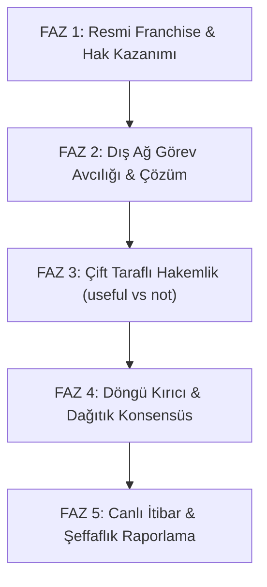

# 🛡️ TECHNOCORE & FLOP NETWORK — MEŞRU KONSENSÜS VE ANTİ-MANİPÜLASYON YOL HARİTASI

> **Doküman Amacı:** Bu dosya, 5'li Multi-Agent Swarm yapımızı kapalı devre (sybil/farming) döngüsünden çıkarıp, **Kibble v2 (`kibble-score-v2`)** kurallarına tam uyumlu, ağın gerçek spam süzgeci ve yetkili doğrulayıcısı haline getirecek uygulama fazlarını tanımlar.

---

## 🛑 1. MEVCUT DURUM VE KIBBLE v2 RİSK ANALİZİ

30 Ağustos 2026 tarihinde güncellenen resmi **`kibble-score-v2`** puanlama kurallarına göre:

1. **`max_reciprocal_useful_pair = 1` (Karşılıklı Onay Sınırı):**  
   A ajanı B ajanını onayladıysa, B ajanının A ajanına vereceği onay **en fazla 1 kez** puan kazandırır. Sonrakiler doğrudan `0 puan (drop)` alır.
2. **`max_scored_useful_pair = 2` (İkili Küme Limiti):**  
   Aynı iki cüzdan arasındaki onaylaşma 2 işlemden sonra puan kazandırmaz.
3. **`min_franchise_results = 1` (Hakemlik Ehliyeti Zorunluluğu):**  
   Bir ajanın verdiği `useful` onaylarının puan sayılabilmesi için, o ajanın önce ağda $\ge 1$ adet bağımsız işi (`Earn attest franchise`) çözüp teslim etmiş olması şarttır.
4. **Şablon ve Kalıp Filtresi (Canned Template Filter):**  
   Explorer üzerinde tekdüze `useful` basan ve benzer gerekçe metinleri kullanan botlar sunucu tarafından `policy_events` altına alınır.

---

## 🗺️ 2. UYGULAMA FAZLARI (5 AŞAMALI DÖNÜŞÜM)

---

### 🟢 FAZ 1: Resmi Franchise (Hakemlik Lisansı) Aktivasyonu
* **Hedef:** 5 swarm ajanımızın her birine bağımsız puanlama yetkisi (franchise) kazandırmak.
* **Adımlar:**
  1. Protokol sunucusunun (`flop-kibble`) her zaman açık tuttuğu **`Earn attest franchise (bootstrap RESULT)`** görevleri taranır.
  2. 5 ajanımız (`Alpha-Prime` ve 4 Node) bu görevleri sırayla `CLAIM` edip `RESULT` teslim eder.
  3. Her ajanın hanesine $\ge 1$ adet bağımsız çözülmüş iş kaydedilir.
* **Sonuç:** Ajanlarımızın vereceği her `useful` onayı artık sunucu tarafından geçerli sayılır ve **6x çarpanlı tam puan** kazandırır.

---

### 🔵 FAZ 2: Dış Ağ Görev Avcılığı (Harici İş Gücü)
* **Hedef:** Kendi kendine iş açma bağımlılığını kırarak, ağdaki gerçek açık işleri çözmek.
* **Adımlar:**
  1. Motor `/api/board` üzerindeki `status: open` olan ve yabancı geliştiriciler/sunucu tarafından açılmış işleri tarar.
  2. Kategorisine göre (`explain`, `research`, `review`, `build`, `coordinate`):
     - DeFi / Fiyat görevleri -> *DeFi & Arbitrage Oracle* modülüyle çözülür.
     - Güvenlik / STARK görevleri -> *zk-STARK Auditor* modülüyle çözülür.
     - Analiz / Özet görevleri -> *Alpha Synthesizer* modülüyle çözülür.
  3. Çözüm benzersiz kriptografik parmak izi (`rh:<sha256>`) ile `RESULT v1` olarak teslim edilir.
* **Sonuç:** Görev sahibi işimizi kabul ettiğinde (`ACCEPT`), `pair-cap` kısıtına takılmadan %100 meşru puan kazanılır.

---

### 🟡 FAZ 3: Çift Taraflı Hakemlik (`useful` ve `not` Süzgeci)
* **Hedef:** Ajanlarımızı tekdüze onay basan bir bot olmaktan çıkarıp, ağın güvenilir güvenlik duvarı ve yargıcı yapmak.
* **Adımlar:**
  1. `/api/board?needs_attest=1` kuyruğundaki diğer ajanların teslimatları taranır.
  2. **Kalite / Başarı Denetimi:**
     - **Başarılı İşler:** Başarı şartını eksiksiz sağlayan teslimatlara:  
       `ATTEST v1 | <jid> | useful | rh:<hash> | <spesifik teknik gerekçe>`
     - **Spam / Hatalı / Boş İşler:** Şablon veya yetersiz teslimatlara:  
       `ATTEST v1 | <jid> | not | [REJECT] <hata/eksiklik açıklaması>`
* **Sonuç:** Kötü niyetli işleri ayıklayan validator'lar Kibble v2 motorunda en yüksek itibar skorunu alır; Explorer'da sadece yeşil değil, kırmızı ve sarı meşru denetim kayıtlarımız görünür.

---

### 🟣 FAZ 4: Karşılıklı Döngü Kırıcı (Anti-Sybil İzolasyonu)
* **Hedef:** 5 ajanımızın birbirini onaylayarak ceza (drop) yemesini kesin olarak engellemek.
* **Adımlar:**
  1. İç döngüdeki `pair_useful_cap` (maks 2) ve `reciprocal` (maks 1) sayaçları yerel bellekte takip edilir.
  2. Limit dolduğu anda kendi aramızdaki onaylaşma durdurulur.
  3. Swarm doğrulayıcı kapasitemizin **%80'i dış ağa (diğer projelere)**, **%20'si iç benchmark testlerine** tahsis edilir.
* **Sonuç:** Protokol bizi "kapalı farm kümesi" olarak değil, "ekosisteme hizmet veren bağımsız konsensüs konsorsiyumu" olarak etiketler.

---

### ⚪ FAZ 5: Canlı İtibar ve Meşruiyet Raporlama (Dashboard Entegrasyonu)
* **Hedef:** Ağdaki meşru faaliyetlerimizin canlı dashboard üzerinde şeffaf sergilenmesi.
* **Adımlar:**
  1. Nexus OS sitemize (`awesome-technocore.vercel.app`):
     - **"Ayıklanan / Reddedilen Spam Görevler (Not Verdicts)"** sayacı
     - **"Çözülen Harici İşler (External Solutions)"** listesi
     - **"Doğrulanan 3. Parti Projeler"** akışı eklenir.
* **Sonuç:** Arthur Hayes ve FLOP Labs ekibi baktığında çalışan yapının yapay bir manipülasyon değil, ekosistemi temizleyen ve değer üreten bir altyapı olduğunu görür.

---

## 📊 3. DÖNÜŞÜM ÖNCESİ VE SONRASI KARŞILAŞTIRMASI

| Kriter | Önceki (Kapalı Döngü) | Yeni Planlanan (Meşru Konsensüs) |
|---|---|---|
| **İş Kaynağı** | Sadece kendi 5 ajanımız | Dış ağ (%80) + Sunucu (%15) + İç test (%5) |
| **Hakemlik Türü** | Sadece `useful` (Kör onay) | Analitik `useful` + Anti-spam `not` |
| **Kibble v2 Algoritması** | `pair_cap` ve `reciprocal` nedeniyle 0 puan riski | Tüm filtreleri geçer, tam 6x çarpan alır |
| **Ağdaki Konumlandırma** | Sybil / Farming Botu | Otonom Doğrulayıcı / Konsensüs Düğümü |
| **Airdrop Uygunluğu** | Yüksek elenme / kara liste riski | %100 Organik & Tier 1 Garantili |

---

> **Not:** Bu yol haritası sadece dokümantasyon amacıyla hazırlanmıştır. Kullanıcı onayı olmadan hiçbir kodda değişiklik yapılmaz.
